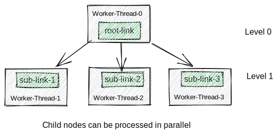
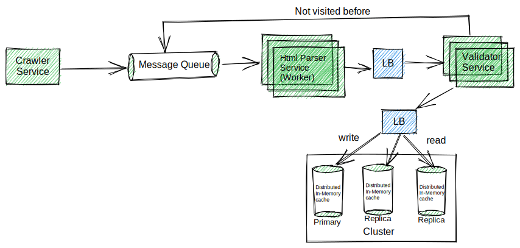

# Kotlin Web Crawler

This repository is intended to demonstrate the high-level design and implementation details of the web crawler.

## Problem statement
We'd like you to write a simple web crawler in a programming language you're familiar with. Given a starting URL, the crawler should visit each URL it finds on the same domain. It should print each URL visited, and a list of links found on that page. The crawler should be limited to one subdomain - so when you start with *https://example.com/*, it would crawl all pages on the example.com website, but not follow external links, for example to facebook.com or community.example.com.

## Background and Definitions
The `web crawler` is a program, which automatically traverses the web by downloading documents and following links from page to page. They are mainly used by search engine, so that pages can be indexed in advance to be able to respond to many user queries rapidly.

## Requirements
* It should visit each URL it finds on the same domain.
* It should print each URL visited, and a list of links found on that page.
* The crawler should be limited to one subdomain(not follow external links, example facebook.com or community.example.com.)

## Proposed solutions
We can think of the Web as a directed graph where nodes are web pages and links(URLs) are edges. 
The web-crawler can be seen as traversing a directed graph from one page to others. So we can use DFS and BFS as graph traversal algorithms.

### Proposed solution 1: DFS order
#### Pros
* LIFO order. Starts at the root node and explores as far as possible along each branch before backtracking.
* Can be more memory-efficient in cases with deep graphs, as it doesn't need to store all nodes at the same level.

#### Cons
* Can get into loops or dead ends when website has a complex link structure(the depth of the DFS can be very deep), however we can set the limit to the depth of the search domain to prevent that issue.
* Limited Call-stack size might cause the StackOverflowError.

### Proposed solution 2: BFS order
#### Pros
* FIFO(Level-Order) traversal. Starts at the tree root and explores all nodes at the present depth prior to moving on to the nodes at the next depth level.

#### Cons
* May consume more memory than DFS when exploring deep graphs because it needs to store all nodes in memory at each level.
* The Web is large and if a page has many links it may not fit in memory, however, like DFS, we can set a limit on the number of links at each level to prevent this problem.

## Prerefered solution
The time complexity of both DFS and BFS traversal is `O(V + E)`, where `V` and `E` are the total number of vertices and edges in the graph, respectively.
However, for this specific problem, it is preferable to traverse all links of a particular page in a natural order(explore the neighbor nodes first, before moving to the next-level neighbors). Thus, Level order traversal is ideal for this case.
## High-level design


## Design Choices
#### Use Kotlin to implement the crawler
* Requires fewer lines of code than Java.
* Interoperability with Java.
* Coroutine support.

#### Use Jsoup as HTML parser
* Easy to use Java HTML Parser library.
* Reeduces boilerplate code, so no need to worry about `REGEX` pattern to parse all links.

## Data structures
* `HashTable` to keep track of visited links.
* `Queue` to maintain FIFO order.

## Local Testing
### Run the Web Crawler
```
# BASE_URL - input url, DOMAIN - input domain, MAX_LEVEL - input maximum depth
make crawl BASE_URL=${BASE_URL} DOMAIN=${DOMAIN} MAX_LEVEL=${MAX_LEVEL}
```
```
# Example
make crawl BASE_URL=https://example.com DOMAIN=example.com MAX_LEVEL=3
```

*******************
## Desing at Scale
### High-Level Design

### Optimizations
* `BloomFilter` instead of the Distributed Cache. The BloomFilter is a space-efficient data structure that lets you quickly check whether or not an item is in a set.
